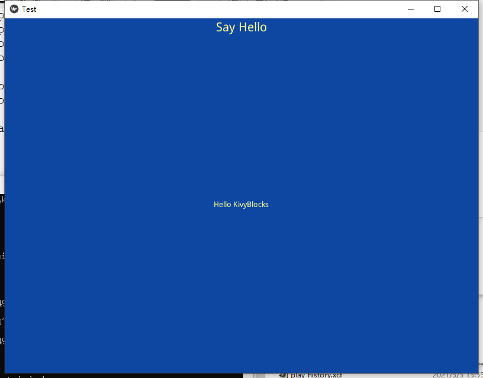

# KivyBlocks
Can you ever image build a gui application like play Lego blocks? kivyblocks just try to provide programmer a tool to build a application like play lego blocks

kivyblocks base on the python package 'kivy', which is a cross platform GUI package and can play on window, linux, mac OS x, android and iphone

## Requirement

[appPublic](https://github.com/yumoqing/appPublic)
[kivycalendar](https://github.com/yumoqing/kivycalendar)
[kivy](https://github.com/kivy/kivy)
...
see the [requirements.txt](./requirements.txt)

## Principle

There is a BlocksApp(inherited from App) in kivyblocks contains a all widgets can be created by Blocks, and the Blocks creates widgets according a customized json data, the data can download from application server or local filesystem. 
The Customized json data has it own format to descript the UI and it's interaction. please see the "Customized json data" section for further information.

## installation
```
pip install git+https://github.com/yumoqing/kivyblocks
```
Use above command to install the newest version of kivyblocks
## How to use
see the simple example below:
```
import sys
import os
from appPublic.folderUtils import ProgramPath
from appPublic.jsonConfig import getConfig

from kivyblocks.blocksapp import BlocksApp
from kivyblocks.blocks import Blocks

class TestApp(BlocksApp):
	def build(self):
		b = super(TestApp, self).build()
		widget_desc = {
			"widgettype":"VBox",
			"options":{},
			"subwidgets":[
				{
					"widgettype":"Title1",
					"options":{
						"text":"Say Hello",
						"i18n":True,
						"size_hint_y":None,
						"height":"py::CSize(2)"
					}
				},
				{
					"widgettype":"Text",
					"options":{
						"text":"Hello KivyBlocks"
					}
				}
			]
		}
		blocks = Blocks()
		x = blocks.widgetBuild(widget_desc)
		return x


if __name__ == '__main__':
	pp = ProgramPath()
	workdir = pp
	if len(sys.argv) > 1:
		workdir = sys.argv[1]
	print('ProgramPath=',pp,'workdir=',workdir)

	config = getConfig(workdir,NS={'workdir':workdir,'ProgramPath':pp})
	myapp = TestApp()
	myapp.run()
```
if you running it on window, it will show the following:


## Documents
[中文文档](./docs/cn/index.md)
[English](./docs/en/index.md)

## references

Build app for android please see [Buildozer](https://github.com/kivy/buildozer)
kivy introduct and API please see [kivy](https://kivy.org)

## Changelog
[changelog](docs/changelog.md)
